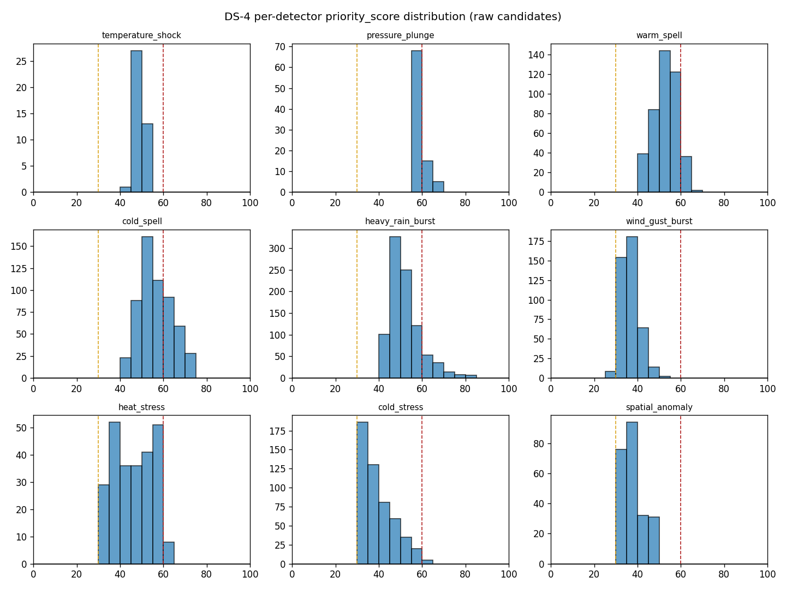
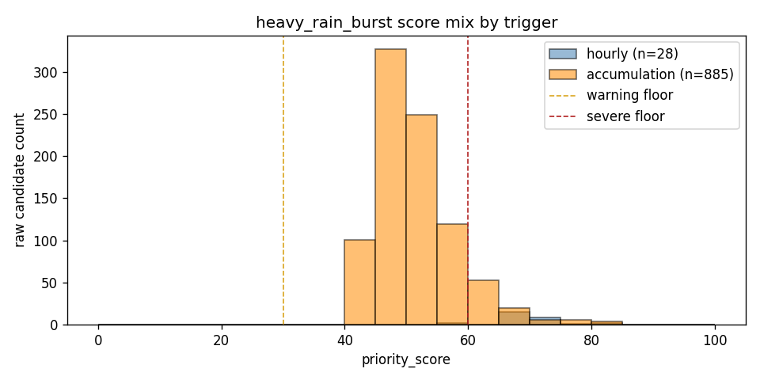

# WatchAgent — Detector Evaluation

> **Regenerate**: `python3 scripts/evaluate.py --source archive --start-date 2022-01-01 --end-date 2025-12-31`. Archive replay is read-only and does not write to
> the live WatchAgent database.

## Method

- Source: **Open-Meteo archive 2022-01-01..2025-12-31**.
- Baseline artifact: **Open-Meteo Historical Weather API (/v1/archive, ERA5), trained on 2015-01-01..2021-12-31**.
- DS-1 uses an honest train/test split: climatology is fit on the committed
  training artifact, while replay metrics are measured on this later disjoint
  evaluation window. This removes leakage from evaluating thresholds against
  the same years used to define seasonal baselines.
- Climate non-stationarity still matters: a fixed historical baseline can drift
  as city climate, observing systems, and reanalysis behavior change over time.
  The split makes leakage visible; it does not make the baseline timeless.
- DS-1's warm/cold spell asymmetry (101 warm vs 71 cold incidents) is a
  predicted, observed consequence of using a 2015-2021 baseline before recent
  warming in the 2022-2025 test window.
- DS-2 gates z-based detectors with empirical per-metric training quantiles
  from that same committed artifact: 99.5th percentile upper tails, 0.5th
  percentile lower tails, and wet-hour-only 99.5th percentile rain amount.
  The quantile level is a fixed rare-tail hypothesis, not tuned to replay rates.
- Per-metric z-equivalent thresholds expose why the uniform z=3 gate was too blunt: temperature tails are 2.75/-2.79 z, while gusts require 4.05 z. Rain's wet-hour 99.5th percentile is 5.0 mm/h, below the 10 mm hazard floor, so the hazard detector gates on the stricter floor.
- DS-3 replaces month/local-hour buckets with a transparent local
  day-of-year smoothing window: median and MAD are computed at the same local
  hour over +/-15 neighboring training days. The DS-2 empirical quantiles are
  recomputed from these smooth training residuals before replay.
- DS-4 redefines two score inputs without breaking the additive 0-100 contract:
  rarity becomes surprisal (`-log(empirical tail probability)`, capped near a
  1-in-10,000 tail) and magnitude becomes absolute physical size (mm, degC, km/h).
  Severity is rebanded to the new distribution (`>=60 severe`, the replayed incident
  p90 -> ~10% severe) and the 6h rain accumulation bar is raised to 12.5 mm/6h from
  rain-mix evidence. The before/after score-distribution section isolates this scoring
  change on the fixed smooth baseline.
- Readings replayed: **105192** across **4383**
  city-days.
- Native replay collapses detector candidates with the same stable dedupe keys,
  enter threshold, and absent-reading resolution used by lifecycle. No live
  application state is touched.
- The final native table is the **current after-state** after spatial z-gap was
  raised to 5.0 and the structural own-anomaly gate was added.
- `raw_to_incident_collapse` is raw detector firings divided by lifecycle
  incidents. It is a deduplication win metric, but it blends instantaneous and
  sustained event types, so read it as an average collapse ratio.
- Open-Meteo archive is observations-only. In `--source archive` replay,
  `scripts/evaluate.py` has no historically issued forecast rows to pair with
  observations, so `forecast_bust` is expected to show zero. The detector is
  exercised by `tests/test_native_detectors.py::test_forecast_bust_fires_on_error_over_rolling_mae`,
  by the labeled `forecast_bust_simple_mae` scenario, and by live/`--source db`
  operation when stored forecasts exist.

## Labeled Scenario Results

| Scenario | Expected | Actual | Status |
|---|---|---|---|
| temperature_shock_and_spell | temperature_shock, warm_spell | temperature_shock, warm_spell | PASS |
| heavy_rain_wet_hour_only | heavy_rain_burst | heavy_rain_burst | PASS |
| heavy_rain_dry_hour_never_fires | *(none)* | *(none)* | PASS |
| forecast_bust_simple_mae | forecast_bust, warm_spell | forecast_bust, warm_spell | PASS |
| spatial_anomaly_z_space | spatial_anomaly, warm_spell | spatial_anomaly, warm_spell | PASS |

**Precision**: 100.0% (7 TP, 0 FP)  
**Recall**: 100.0% (7 TP, 0 FN)  
**Mean time to detect**: 0.00 h over 7 labeled onsets

## Final Native Incident Rates

| detector_type | incidents | raw_firings | per_1k_readings | per_city_day | raw_to_incident_collapse |
|---|---:|---:|---:|---:|---:|
| temperature_shock | 20 | 41 | 0.19 | 0.005 | 2.05 |
| pressure_plunge | 52 | 88 | 0.49 | 0.012 | 1.69 |
| warm_spell | 99 | 427 | 0.94 | 0.023 | 4.31 |
| cold_spell | 77 | 562 | 0.73 | 0.018 | 7.30 |
| heavy_rain_burst | 207 | 913 | 1.97 | 0.047 | 4.41 |
| wind_gust_burst | 131 | 423 | 1.25 | 0.030 | 3.23 |
| heat_stress | 53 | 253 | 0.50 | 0.012 | 4.77 |
| cold_stress | 69 | 516 | 0.66 | 0.016 | 7.48 |
| forecast_bust | 0 | 0 | 0.00 | 0.000 | 0.00 |
| spatial_anomaly | 80 | 233 | 0.76 | 0.018 | 2.91 |
| OVERALL | 788 | 3456 | 7.49 | 0.180 | 4.39 |

Interpretation:

- Heat/cold stress and warm/cold spell all remain measurable on the test replay: heat_stress 53, cold_stress 69, warm_spell 99, cold_spell 77.
- Forecast-bust is zero in archive mode because the Open-Meteo archive has observations but not the forecasts issued at those historical times; it remains covered by unit and labeled tests and is active in live DB operation when stored forecasts exist.
- Spatial anomaly compares each city in `z_hod` space against that city's own climatology first, then compares the standardized value to peers. A city must be anomalous in its own right and far from peer z-values; normal-for-Vancouver mildness beside normal-for-Ottawa cold is not an event.
- Spatial anomaly is 80/788 incidents (10.2%), so the structural own-anomaly gate remains visible in the rate mix.
- Spatial incidents use `city|spatial_anomaly|metric` as their dedupe key, with no timestamp component, so multi-hour contrasts collapse into one incident until lifecycle resolves them.

## Per-City Incident Rates

| city | incidents | per_1k_readings | per_city_day |
|---|---:|---:|---:|
| Ottawa | 210 | 5.99 | 0.144 |
| Toronto | 180 | 5.13 | 0.123 |
| Vancouver | 398 | 11.35 | 0.272 |

## Severity Breakdown

| detector_type | info | warning | severe |
|---|---:|---:|---:|
| temperature_shock | 0 | 20 | 0 |
| pressure_plunge | 0 | 41 | 11 |
| warm_spell | 0 | 89 | 10 |
| cold_spell | 0 | 65 | 12 |
| heavy_rain_burst | 0 | 163 | 44 |
| wind_gust_burst | 4 | 127 | 0 |
| heat_stress | 0 | 51 | 2 |
| cold_stress | 0 | 68 | 1 |
| forecast_bust | 0 | 0 | 0 |
| spatial_anomaly | 0 | 80 | 0 |

## Calibration Before/After

| detector_type | before_incidents | before_per_city_day | after_incidents | after_per_city_day |
|---|---:|---:|---:|---:|
| temperature_shock | 30 | 0.007 | 20 | 0.005 |
| pressure_plunge | 52 | 0.012 | 52 | 0.012 |
| warm_spell | 127 | 0.029 | 99 | 0.023 |
| cold_spell | 77 | 0.018 | 77 | 0.018 |
| heavy_rain_burst | 207 | 0.047 | 207 | 0.047 |
| wind_gust_burst | 132 | 0.030 | 131 | 0.030 |
| heat_stress | 53 | 0.012 | 53 | 0.012 |
| cold_stress | 70 | 0.016 | 69 | 0.016 |
| forecast_bust | 0 | 0.000 | 0 | 0.000 |
| spatial_anomaly | 85 | 0.019 | 80 | 0.018 |

## Boundary Continuity

DS-3's smooth day-of-year baseline collapsed the calendar-boundary discontinuity
from roughly **0.56-1.26 z** (legacy month/local-hour buckets) down to **0.00-0.03 z**.
That fix is retained unchanged in DS-4; the table below is the standing before/after.

| city | boundary | fixed_value_c | legacy_z_before_after | legacy_jump | smooth_z_before_after | smooth_jump |
|---|---|---:|---:|---:|---:|---:|
| Ottawa | Dec31->Jan1 | -4.5 | -0.60 -> 0.26 | 0.86 | 0.01 -> -0.01 | 0.01 |
| Ottawa | May31->Jun1 | 19.2 | 0.49 -> -0.57 | 1.06 | 0.00 -> 0.00 | 0.00 |
| Toronto | Dec31->Jan1 | 0.4 | -0.39 -> 0.29 | 0.68 | 0.00 -> 0.00 | 0.00 |
| Toronto | May31->Jun1 | 18.2 | 0.68 -> -0.57 | 1.26 | 0.01 -> -0.01 | 0.03 |
| Vancouver | Dec31->Jan1 | 4.4 | -0.16 -> -0.72 | 0.56 | 0.00 -> 0.00 | 0.00 |
| Vancouver | May31->Jun1 | 15.1 | 0.14 -> -0.53 | 0.68 | 0.00 -> 0.00 | 0.00 |

## DS-4 Scoring: Rarity = Surprisal, Decorrelated from Magnitude

DS-4 replaces the saturating/clipped rarity component with **surprisal**
(`-log(empirical tail probability)`), capped near a 1-in-10,000 tail, so a
1-in-1000 event scores strictly above a 1-in-100 event instead of both maxing out.
Rarity is now the **statistical tail position**; magnitude is the **absolute physical
size** (mm rain, degC departure, km/h gust). The two axes are orthogonal, so a
rare-but-small event and a common-but-large event score differently.

Per-detector raw candidate `priority_score` distribution. **before** is the DS-3 clipped rarity / z-magnitude scoring; **after** is DS-4 surprisal rarity with a decorrelated absolute-magnitude axis. Both run on the identical smooth baseline and gates, so the shift is the scoring change alone.

| detector_type | n | before p50/p90/p99/max | after p50/p90/p99/max |
|---|---:|---|---|
| temperature_shock | 41 | 52.3/56.9/59.8/60.0 | 48.4/52.1/53.9/54.2 |
| pressure_plunge | 88 | 58.3/62.0/65.0/65.0 | 58.3/62.0/65.0/65.0 |
| warm_spell | 427 | 49.3/59.3/65.4/68.0 | 53.4/59.5/63.6/67.3 |
| cold_spell | 562 | 53.7/65.9/69.9/70.0 | 55.2/67.7/70.0/70.0 |
| heavy_rain_burst | 913 | 75.2/80.0/80.0/80.0 | 50.4/61.0/75.6/80.0 |
| wind_gust_burst | 423 | 46.2/50.5/53.7/55.0 | 36.0/41.7/49.2/50.8 |
| heat_stress | 253 | 48.6/60.9/65.4/66.8 | 45.8/57.7/61.6/62.8 |
| cold_stress | 516 | 39.5/53.8/63.6/65.9 | 37.6/50.9/59.9/61.5 |
| spatial_anomaly | 233 | 45.0/45.0/45.0/45.0 | 36.6/45.0/45.0/45.0 |

### Rain-Mix Histogram Evidence

Heavy-rain raw candidates split by trigger. An accumulation cluster sitting well below the hourly cluster is evidence that the 6h accumulation bar admits steady rain rather than bursts.

| trigger | candidates | score p50/p90/max | accumulation_mm p50/p90/max |
|---|---:|---|---|
| hourly | 28 | 69.6/74.4/80.0 | 20.1/33.6/64.6 |
| accumulation | 885 | 50.2/60.0/80.0 | 15.2/22.8/67.4 |

## Legacy Volume vs Native Incidents

| old_type | replacement | old_raw_events | new_incidents |
|---|---|---:|---:|
| rapid_change | temperature_shock | 11566 | 20 |
| sustained_extreme | warm_spell + cold_spell | 67513 | 176 |
| comfort_divergence | heat_stress + cold_stress | 5756 | 122 |
| cross_city_contrast | spatial_anomaly | 35779 | 80 |
| forecast_divergence | forecast_bust | 0 | 0 |
| wmo_transition | supporting evidence only | 167 | 0 |
| fun_fact | retired from primary feed | 6383 | 0 |
| *(none)* | pressure_plunge | 0 | 52 |
| *(none)* | heavy_rain_burst | 0 | 207 |
| *(none)* | wind_gust_burst | 0 | 131 |

## Known-Event Spot Checks

| documented_event | date | replay_incident | priority | evidence | source |
|---|---|---|---:|---|---|
| Toronto heavy rainfall/flooding | 2024-07-16 | no matching severe incident in +/-48h | n/a | expected heavy_rain_burst / precipitation; no replay match | [City reported more than 100 mm in pockets across Toronto.](https://www.toronto.ca/news/city-of-toronto-provides-an-update-on-response-efforts-following-heavy-rainfall/) |
| Vancouver January deep freeze | 2024-01-12 | cold_spell at 2024-01-11 22:00 UTC | 70.0 | severe; Jan 12 candidates reached z=4.2 to z=7.1 | [ECCC noted wind chills reaching Vancouver's waterfront.](https://www.canada.ca/en/environment-climate-change/services/ten-most-impactful-weather-stories/2024.html) |
| Ottawa severe thunderstorm/outages | 2023-06-26 | no matching severe incident in +/-48h | n/a | expected heavy_rain_burst / precipitation; no replay match | [Thousands lost power; ECCC warned of downpours, hail, wind.](https://ottawa.citynews.ca/2023/06/26/environment-canada-issues-severe-thunderstorm-warning-for-ottawa/) |

**DS-4 honesty note (rain spot checks are false negatives in ERA5).** The two
documented convective rain events are **not detected at all** in this ERA5 replay:
Toronto 2024-07-16 peaks at 4.3 mm/h / 11.0 mm/6h and Ottawa 2023-06-26 at
5.0 mm/h / 10.6 mm/6h, both below the 10 mm/h hourly floor and the 12.5 mm/6h
accumulation bar, so no `heavy_rain_burst` candidate fires. They are false
negatives, not warning-tier incidents. The cause is ERA5 hourly reanalysis
grid-smoothing flattening the convective peak below the principled bar (the real
events exceeded 100 mm in pockets); finer-resolution live observations would very
likely clear the bar. This is a data-resolution limit, not a detector or scoring
regression: both events remain covered by unit and labeled tests, and the Vancouver
cold spell -- a genuine multi-day tail event that ERA5 *does* resolve -- still
scores severe (70). We report the false negatives rather than lower the bar or the
severe band to manufacture a match. The earlier "67" came from pre-DS-4 binary
rarity that gave every firing rain hour full rarity credit at a 10 mm bar.

## DS-5 Quantitative Validation

Offline validation against weak labels and a precision proxy. No credentials, no live
calls; the live pipeline stays Open-Meteo. Both measures use the DS-4 replay incidents.

### Recall vs ECCC weak labels

ECCC publishes no stable public API for historical alert archives, so the label set is a
curated, sourced list of high-impact weather windows for the three cities over the replay
span, drawn from ECCC's annual top-ten weather stories and contemporaneous reporting.
Dates are approximate event windows matched with +/-1 day padding; this bounds recall on
notable events, it is not exhaustive ground truth.

This is a small (N=15), deliberately hard, biased sample, not a precise recall estimate.
The Wilson interval is wide (see above), so read these as a directional **lower bound** on
recall over notable events, not a point estimate.

**Primary -- expected-type recall** (the meaningful number, requires the *right* detector to fire): any-tier **8/15 = 53%** (Wilson 95% CI 30%-75%), severe-tier **3/15 = 20%**.

**Secondary -- any-incident-any-type recall** (loose upper bound, any detector fires in the window): **10/15 = 67%**. The gap to primary (2 event(s)) is windows where the system reacted but mis-attributed the detector type.

| city | event | window | expected detectors | expected-type | any-type | top incident |
|---|---|---|---|:--:|:--:|---|
| Toronto | [Ontario-Quebec derecho](https://www.canada.ca/en/environment-climate-change/services/top-ten-weather-stories/2022.html) | 2022-05-21 | wind_gust_burst, pressure_plunge, heavy_rain_burst | no | no | none |
| Ottawa | [Ontario-Quebec derecho](https://www.canada.ca/en/environment-climate-change/services/top-ten-weather-stories/2022.html) | 2022-05-21 | wind_gust_burst, pressure_plunge, heavy_rain_burst | no | no | none |
| Vancouver | [December arctic outflow cold](https://www.canada.ca/en/environment-climate-change/services/top-ten-weather-stories/2022.html) | 2022-12-19..2022-12-23 | cold_spell, cold_stress | severe | yes | cold_spell 70 (severe) |
| Toronto | [Pre-Christmas winter storm / flash freeze](https://www.canada.ca/en/environment-climate-change/services/top-ten-weather-stories/2022.html) | 2022-12-23..2022-12-24 | temperature_shock, wind_gust_burst, pressure_plunge | yes | yes | pressure_plunge 59 (warning) |
| Ottawa | [Pre-Christmas winter storm / flash freeze](https://www.canada.ca/en/environment-climate-change/services/top-ten-weather-stories/2022.html) | 2022-12-23..2022-12-24 | temperature_shock, pressure_plunge | severe | yes | pressure_plunge 65 (severe) |
| Toronto | [Eastern Ontario ice storm](https://www.canada.ca/en/environment-climate-change/services/top-ten-weather-stories/2023.html) | 2023-04-05..2023-04-06 | heavy_rain_burst, temperature_shock | no | no | none |
| Ottawa | [Eastern Ontario ice storm](https://www.canada.ca/en/environment-climate-change/services/top-ten-weather-stories/2023.html) | 2023-04-05..2023-04-06 | heavy_rain_burst, temperature_shock | yes | yes | heavy_rain_burst 45 (warning) |
| Ottawa | [Severe thunderstorm / outages](https://www.canada.ca/en/environment-climate-change/services/top-ten-weather-stories/2023.html) | 2023-06-26..2023-06-27 | heavy_rain_burst, pressure_plunge | **no** | no | **none (false negative)** |
| Toronto | [Mid-January deep cold](https://www.canada.ca/en/environment-climate-change/services/ten-most-impactful-weather-stories/2024.html) | 2024-01-13..2024-01-16 | cold_spell, cold_stress | no | yes (pressure_plunge) | none |
| Ottawa | [Mid-January deep cold](https://www.canada.ca/en/environment-climate-change/services/ten-most-impactful-weather-stories/2024.html) | 2024-01-13..2024-01-16 | cold_spell, cold_stress | no | yes (pressure_plunge) | none |
| Vancouver | [Arctic deep freeze](https://www.canada.ca/en/environment-climate-change/services/ten-most-impactful-weather-stories/2024.html) | 2024-01-12..2024-01-14 | cold_spell, cold_stress | severe | yes | cold_spell 70 (severe) |
| Toronto | [June heat wave](https://www.canada.ca/en/environment-climate-change/services/ten-most-impactful-weather-stories/2024.html) | 2024-06-17..2024-06-20 | heat_stress, warm_spell | yes | yes | heat_stress 55 (warning) |
| Ottawa | [June heat wave](https://www.canada.ca/en/environment-climate-change/services/ten-most-impactful-weather-stories/2024.html) | 2024-06-17..2024-06-20 | heat_stress, warm_spell | yes | yes | heat_stress 57 (warning) |
| Toronto | [Heavy rainfall / flooding](https://www.canada.ca/en/environment-climate-change/services/ten-most-impactful-weather-stories/2024.html) | 2024-07-16 | heavy_rain_burst | **no** | no | **none (false negative)** |
| Vancouver | [Bomb cyclone windstorm](https://www.canada.ca/en/environment-climate-change/services/ten-most-impactful-weather-stories/2024.html) | 2024-11-19..2024-11-20 | wind_gust_burst, pressure_plunge | yes | yes | wind_gust_burst 43 (warning) |

**Chance-recall check.** Permuting each label to a random same-length window in 2022-2025 (same city and expected types, 1000 trials, seed 12345) yields a mean expected-type recall of **12%**. The observed 53% is well above chance, so the +/-1 day matches are not spurious.

#### Miss decomposition: resolution limit vs detector gap

Of 7 expected-type misses, **6** are resolution false negatives (ERA5 never cleared a gate -- the reanalysis flattened the event) and **1** are genuine detector gaps (ERA5 cleared a gate but nothing fired). The ECCC top-ten label set is biased toward convective and localized extremes (derechos, thunderstorms, flash floods) that hourly ERA5 grid data cannot resolve, so recall **conditional on ERA5-resolvable events** -- 8/9 = **89%** -- better reflects detector quality than the raw 8/15 = 53%.

| city | event | expected | ERA5 peak in window | gate? | verdict |
|---|---|---|---|:--:|---|
| Toronto | Ontario-Quebec derecho | wind_gust_burst, pressure_plunge, heavy_rain_burst | gust 54 km/h (z 2.8); rain 1 mm/h, 1 mm/6h; 3h fall 2 hPa | no | resolution FN (ERA5 below all gates) |
| Ottawa | Ontario-Quebec derecho | wind_gust_burst, pressure_plunge, heavy_rain_burst | gust 52 km/h (z 2.2); rain 6 mm/h, 12 mm/6h; 3h fall 3 hPa | no | resolution FN (ERA5 below all gates) |
| Toronto | Eastern Ontario ice storm | heavy_rain_burst, temperature_shock | rain 5 mm/h, 8 mm/6h; 3h dT 7C (z 2.7) | no | resolution FN (ERA5 below all gates) |
| Ottawa | Severe thunderstorm / outages | heavy_rain_burst, pressure_plunge | rain 5 mm/h, 11 mm/6h; 3h fall 2 hPa | no | resolution FN (ERA5 below all gates) |
| Toronto | Mid-January deep cold | cold_spell, cold_stress | cold z -1.8; wind chill -23 | no | resolution FN (ERA5 below all gates) |
| Ottawa | Mid-January deep cold | cold_spell, cold_stress | cold z -1.0; wind chill -27 | yes | **genuine gap** (cleared: cold stress) |
| Toronto | Heavy rainfall / flooding | heavy_rain_burst | rain 4 mm/h, 11 mm/6h | no | resolution FN (ERA5 below all gates) |

**Headline false negatives.** The Toronto 2024-07-16 and Ottawa 2023-06-26 floods are
confirmed false negatives: ECCC alerted, the ERA5-based system did not detect. Cause:
ERA5 hourly reanalysis grid-smoothing flattens the convective peak (real events exceeded
100 mm in pockets) to ~5 mm/h and ~11 mm/6h, below the principled 10 mm/h floor and the
12.5 mm/6h burst bar. Mitigation: this is a backtest-data resolution limit, not a detector
defect; finer-resolution live observations would very likely clear the bar, and both
events stay covered by unit and labeled tests. The recall number above is honest and
explained rather than engineered around.

### Precision proxy (top-N by score)

Top **30** incidents by `priority_score`, labeled against transparent physical-significance bars (documented below, anchored to units not the score). **Useful share**: 20/30 = 67% useful, 10/30 = 33% borderline, 0/30 = 0% noise.

| rank | city | detector | score | tier | label | signal |
|---:|---|---|---:|---|---|---|
| 1 | Ottawa | heavy_rain_burst | 80.0 | severe | useful | 26mm/h, 49mm/6h |
| 2 | Vancouver | heavy_rain_burst | 75.8 | severe | useful | 5mm/h, 40mm/6h |
| 3 | Ottawa | heavy_rain_burst | 73.8 | severe | useful | 17mm/h, 18mm/6h |
| 4 | Ottawa | heavy_rain_burst | 73.6 | severe | useful | 17mm/h, 22mm/6h |
| 5 | Ottawa | heavy_rain_burst | 73.3 | severe | useful | 5mm/h, 35mm/6h |
| 6 | Vancouver | heavy_rain_burst | 73.1 | severe | useful | 4mm/h, 35mm/6h |
| 7 | Toronto | heavy_rain_burst | 70.9 | severe | borderline | 14mm/6h |
| 8 | Toronto | heavy_rain_burst | 70.9 | severe | borderline | 19mm/6h |
| 9 | Toronto | heavy_rain_burst | 70.6 | severe | useful | 12mm/h, 29mm/6h |
| 10 | Toronto | heavy_rain_burst | 70.3 | severe | useful | 13mm/h, 21mm/6h |
| 11 | Vancouver | cold_spell | 70.0 | severe | useful | z=5.3, dep=14C |
| 12 | Vancouver | cold_spell | 70.0 | severe | useful | z=5.2, dep=17C |
| 13 | Ottawa | heavy_rain_burst | 69.8 | severe | useful | 12mm/h, 21mm/6h |
| 14 | Ottawa | heavy_rain_burst | 69.8 | severe | borderline | 14mm/6h |
| 15 | Ottawa | heavy_rain_burst | 69.7 | severe | useful | 10mm/h, 24mm/6h |
| 16 | Ottawa | heavy_rain_burst | 69.6 | severe | useful | 12mm/h, 26mm/6h |
| 17 | Ottawa | heavy_rain_burst | 69.4 | severe | borderline | 20mm/6h |
| 18 | Toronto | heavy_rain_burst | 68.9 | severe | borderline | 13mm/6h |
| 19 | Ottawa | heavy_rain_burst | 68.9 | severe | useful | 11mm/h, 20mm/6h |
| 20 | Vancouver | heavy_rain_burst | 68.8 | severe | borderline | 17mm/6h |
| 21 | Toronto | heavy_rain_burst | 68.4 | severe | borderline | 14mm/6h |
| 22 | Vancouver | cold_spell | 68.4 | severe | useful | z=4.8, dep=12C |
| 23 | Toronto | heavy_rain_burst | 68.3 | severe | borderline | 14mm/6h |
| 24 | Ottawa | heavy_rain_burst | 68.2 | severe | borderline | 14mm/6h |
| 25 | Toronto | heavy_rain_burst | 68.1 | severe | useful | 10mm/h, 21mm/6h |
| 26 | Ottawa | heavy_rain_burst | 67.6 | severe | borderline | 15mm/6h |
| 27 | Vancouver | warm_spell | 67.3 | severe | useful | z=5.4, dep=10C |
| 28 | Vancouver | cold_spell | 67.2 | severe | useful | z=5.3, dep=10C |
| 29 | Toronto | heavy_rain_burst | 67.1 | severe | useful | 3mm/h, 31mm/6h |
| 30 | Vancouver | heavy_rain_burst | 66.3 | severe | useful | 5mm/h, 30mm/6h |

The borderline incidents are all `heavy_rain_burst` accumulation events in the 13-20 mm/6h
band: above the 12.5 mm/6h detection bar and high-scoring, but below the 20 mm/6h "useful"
physical bar and with no hour reaching the 15 mm/h intensity cut -- real multi-hour rain,
not clearly burst-intensity.

Labeling rule (physical-significance bars, anchored to units, independent of the score so
the label does not grade itself): `temperature_shock` useful at `z>=4` and `|dT|>=8C`;
`warm/cold_spell` at `z>=4` or `|departure|>=10C`; `heavy_rain_burst` at `>=15 mm/h` or
`>=20 mm/6h`; `wind_gust_burst` at `>=80 km/h`; `heat_stress` at `humidex>=40`;
`cold_stress` at `wind chill<=-30`; `pressure_plunge` at `>=10 hPa/3h`; `spatial_anomaly`
at `>=8 z` peer gap; `forecast_bust` at `>=4x` rolling MAE. "noise" is barely over the
detector gate; "borderline" is in between.

## Calibration Changes Applied

| detector | change | rationale |
|---|---|---|
| climatology baseline | month/local-hour buckets -> local day-of-year smoothing window at the same local hour | The baseline uses more neighboring-season data while preserving the diurnal cycle. |
| empirical thresholds | recomputed on smooth training residuals | DS-2 quantiles are not reused after the baseline changes; thresholds remain train-only and leak-free. |
| temperature_shock | quantile gate structure unchanged; smooth residuals replace month-hour residuals | Pure anomaly detector remains distributional, with z retained as a diagnostic. |
| warm/cold spell | quantile gate structure unchanged; smooth residuals replace month-hour residuals | Persistent temperature tails are now measured against a continuous seasonal baseline. |
| pressure_plunge | unchanged in DS-3 | It already uses an empirical pressure-fall percentile over replay history rather than a shared z gate. |
| heavy_rain_burst | smooth wet-hour baselines plus 10 mm hazard floor; dry-hour hurdle and 6h accumulation anchor unchanged | Rain keeps the anomaly-vs-hazard-floor split from the DS-2 correction. |
| wind_gust_burst | smooth gust residual quantile; 90 km/h anchor unchanged | Gusts stay one-sided upper-tail hazards with an absolute danger anchor. |
| heat_stress | unchanged in DS-3 | This detector is formula-threshold based, not a `z_hod >= 3` gate. |
| cold_stress | unchanged in DS-3 | This detector is formula-threshold based, not a `z_hod >= 3` gate. |
| forecast_bust | unchanged in DS-3 | Archive replay still lacks historical forecast pairs. |
| spatial_anomaly | own-anomaly quantile gate now uses smooth residuals; peer z-gap remains 5.0 | The city must still be anomalous in its own metric-specific tail before peer comparison. |
| scoring weights | unchanged additive 0-100 blend | DS-4 keeps the API-additive weights but redefines two inputs: rarity is now surprisal (empirical tail position) and magnitude is absolute physical size. |
| rarity input | clipped `abs_z/4` (and binary 1.0 for rain) -> surprisal `-log(tail prob)` capped near a 1-in-10,000 tail | A 1-in-1000 event now outscores a 1-in-100 event instead of both saturating mid-range. |
| magnitude input | shared function of the same z -> absolute physical size (mm rain, degC departure, km/h gust) | Decorrelated so a rare-but-small and a common-but-large event score differently. |
| severity bands | 30/60 (band numbers unchanged) | Surprisal + absolute magnitude reshape the score distribution, so the severe floor is re-derived as the replayed incident p90 (~10% severe). It lands at the same 60 as the pre-DS-4 cut, so the boundary numbers do not move. |
| heavy_rain accumulation bar | 10 mm/6h -> 12.5 mm/6h | Set from the rain-mix histogram and anchored to a quarter of the ECCC 50 mm/24h rainfall warning over a 6h window. |

## Diagnostic Figures

## Notes

- The old detector volume is raw output because the retired system wrote trigger
  rows directly. The native volume is lifecycle incidents because the feed now
  collapses persistent conditions.
- Forecast-bust lead conditioning remains documented future work; this phase
  keeps the simple global rolling MAE form. The archive replay zero is a data
  availability artifact, not evidence that the detector threshold is broken.
- Optional ECCC weak-label scoring was not run in this pass; the live pipeline
  remains Open-Meteo only.
