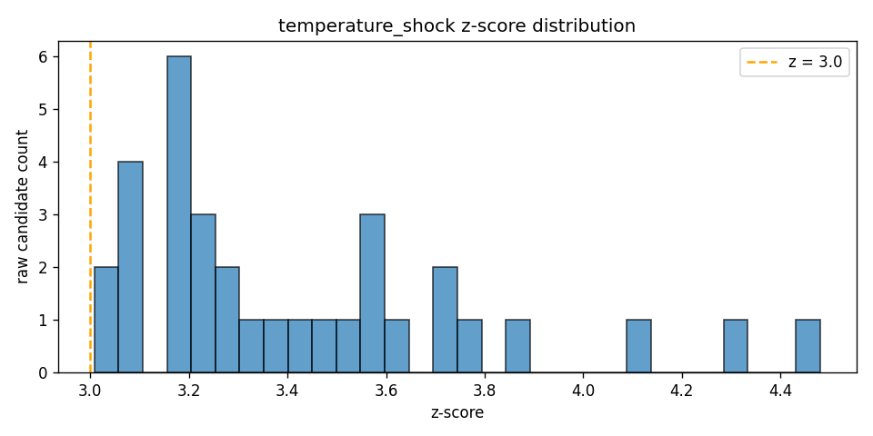
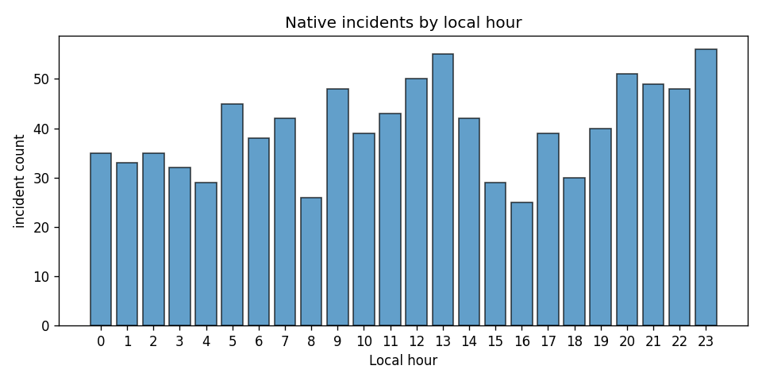
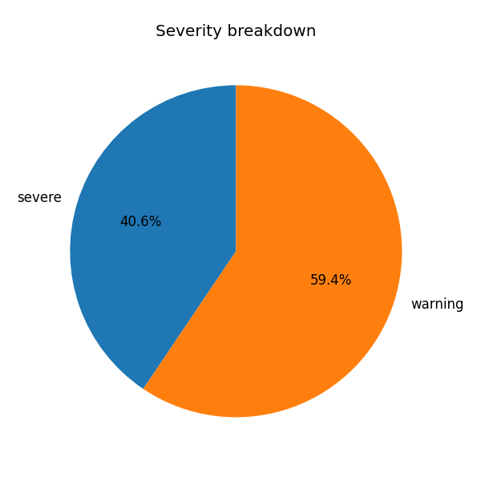

# WatchAgent — Detector Evaluation

> **Regenerate**: `python3 scripts/evaluate.py --source archive --start-date 2022-01-01 --end-date 2025-12-31`. Archive replay is read-only and does not write to
> the live WatchAgent database.

## Method

- Source: **Open-Meteo archive 2022-01-01..2025-12-31**.
- Baseline artifact: **Open-Meteo Historical Weather API (/v1/archive, ERA5), trained on 2015-01-01..2021-12-31**.
- DS-1 uses an honest train/test split: climatology is fit on the committed
  training artifact, while replay metrics are measured on this later disjoint
  evaluation window. This removes leakage from evaluating thresholds against
  the same years used to define seasonal baselines.
- Climate non-stationarity still matters: a fixed historical baseline can drift
  as city climate, observing systems, and reanalysis behavior change over time.
  The split makes leakage visible; it does not make the baseline timeless.
- DS-1's warm/cold spell asymmetry (101 warm vs 71 cold incidents) is a
  predicted, observed consequence of using a 2015-2021 baseline before recent
  warming in the 2022-2025 test window.
- DS-2 gates z-based detectors with empirical per-metric training quantiles
  from that same committed artifact: 99.5th percentile upper tails, 0.5th
  percentile lower tails, and wet-hour-only 99.5th percentile rain amount.
  The quantile level is a fixed rare-tail hypothesis, not tuned to replay rates.
- Per-metric z-equivalent thresholds expose why the uniform z=3 gate was too blunt: temperature tails are 2.79/-2.94 z, while gusts require 4.06 z. Rain's wet-hour 99.5th percentile is 5.0 mm/h, below the 10 mm hazard floor, so the hazard detector gates on the stricter floor.
- Readings replayed: **105192** across **4383**
  city-days.
- Native replay collapses detector candidates with the same stable dedupe keys,
  enter threshold, and absent-reading resolution used by lifecycle. No live
  application state is touched.
- The final native table is the **current after-state** after spatial z-gap was
  raised to 5.0 and the structural own-anomaly gate was added.
- `raw_to_incident_collapse` is raw detector firings divided by lifecycle
  incidents. It is a deduplication win metric, but it blends instantaneous and
  sustained event types, so read it as an average collapse ratio.
- Open-Meteo archive is observations-only. In `--source archive` replay,
  `scripts/evaluate.py` has no historically issued forecast rows to pair with
  observations, so `forecast_bust` is expected to show zero. The detector is
  exercised by `tests/test_native_detectors.py::test_forecast_bust_fires_on_error_over_rolling_mae`,
  by the labeled `forecast_bust_simple_mae` scenario, and by live/`--source db`
  operation when stored forecasts exist.

## Labeled Scenario Results

| Scenario | Expected | Actual | Status |
|---|---|---|---|
| temperature_shock_and_spell | temperature_shock, warm_spell | temperature_shock, warm_spell | PASS |
| heavy_rain_wet_hour_only | heavy_rain_burst | heavy_rain_burst | PASS |
| heavy_rain_dry_hour_never_fires | *(none)* | *(none)* | PASS |
| forecast_bust_simple_mae | forecast_bust, warm_spell | forecast_bust, warm_spell | PASS |
| spatial_anomaly_z_space | spatial_anomaly, warm_spell | spatial_anomaly, warm_spell | PASS |

**Precision**: 100.0% (7 TP, 0 FP)  
**Recall**: 100.0% (7 TP, 0 FN)  
**Mean time to detect**: 0.00 h over 7 labeled onsets

## Final Native Incident Rates

| detector_type | incidents | raw_firings | per_1k_readings | per_city_day | raw_to_incident_collapse |
|---|---:|---:|---:|---:|---:|
| temperature_shock | 30 | 52 | 0.29 | 0.007 | 1.73 |
| pressure_plunge | 52 | 88 | 0.49 | 0.012 | 1.69 |
| warm_spell | 127 | 638 | 1.21 | 0.029 | 5.02 |
| cold_spell | 77 | 486 | 0.73 | 0.018 | 6.31 |
| heavy_rain_burst | 333 | 1607 | 3.17 | 0.076 | 4.83 |
| wind_gust_burst | 132 | 430 | 1.25 | 0.030 | 3.26 |
| heat_stress | 53 | 253 | 0.50 | 0.012 | 4.77 |
| cold_stress | 70 | 516 | 0.67 | 0.016 | 7.37 |
| forecast_bust | 0 | 0 | 0.00 | 0.000 | 0.00 |
| spatial_anomaly | 85 | 276 | 0.81 | 0.019 | 3.25 |
| OVERALL | 959 | 4346 | 9.12 | 0.219 | 4.53 |

Interpretation:

- Heat/cold stress and warm/cold spell all remain measurable on the test replay: heat_stress 53, cold_stress 70, warm_spell 127, cold_spell 77.
- Forecast-bust is zero in archive mode because the Open-Meteo archive has observations but not the forecasts issued at those historical times; it remains covered by unit and labeled tests and is active in live DB operation when stored forecasts exist.
- Spatial anomaly compares each city in `z_hod` space against that city's own climatology first, then compares the standardized value to peers. A city must be anomalous in its own right and far from peer z-values; normal-for-Vancouver mildness beside normal-for-Ottawa cold is not an event.
- Spatial anomaly is 85/959 incidents (8.9%), so the structural own-anomaly gate remains visible in the rate mix.
- Spatial incidents use `city|spatial_anomaly|metric` as their dedupe key, with no timestamp component, so multi-hour contrasts collapse into one incident until lifecycle resolves them.

## Per-City Incident Rates

| city | incidents | per_1k_readings | per_city_day |
|---|---:|---:|---:|
| Ottawa | 247 | 7.04 | 0.169 |
| Toronto | 214 | 6.10 | 0.146 |
| Vancouver | 498 | 14.20 | 0.341 |

## Severity Breakdown

| detector_type | info | warning | severe |
|---|---:|---:|---:|
| temperature_shock | 0 | 30 | 0 |
| pressure_plunge | 0 | 41 | 11 |
| warm_spell | 0 | 108 | 19 |
| cold_spell | 0 | 61 | 16 |
| heavy_rain_burst | 0 | 0 | 333 |
| wind_gust_burst | 0 | 132 | 0 |
| heat_stress | 0 | 44 | 9 |
| cold_stress | 0 | 69 | 1 |
| forecast_bust | 0 | 0 | 0 |
| spatial_anomaly | 0 | 85 | 0 |

## Calibration Before/After

| detector_type | before_incidents | before_per_city_day | after_incidents | after_per_city_day |
|---|---:|---:|---:|---:|
| temperature_shock | 21 | 0.005 | 30 | 0.007 |
| pressure_plunge | 52 | 0.012 | 52 | 0.012 |
| warm_spell | 101 | 0.023 | 127 | 0.029 |
| cold_spell | 71 | 0.016 | 77 | 0.018 |
| heavy_rain_burst | 333 | 0.076 | 333 | 0.076 |
| wind_gust_burst | 334 | 0.076 | 132 | 0.030 |
| heat_stress | 53 | 0.012 | 53 | 0.012 |
| cold_stress | 70 | 0.016 | 70 | 0.016 |
| forecast_bust | 0 | 0.000 | 0 | 0.000 |
| spatial_anomaly | 86 | 0.020 | 85 | 0.019 |

## Legacy Volume vs Native Incidents

| old_type | replacement | old_raw_events | new_incidents |
|---|---|---:|---:|
| rapid_change | temperature_shock | 11566 | 30 |
| sustained_extreme | warm_spell + cold_spell | 67513 | 204 |
| comfort_divergence | heat_stress + cold_stress | 5756 | 123 |
| cross_city_contrast | spatial_anomaly | 35779 | 85 |
| forecast_divergence | forecast_bust | 0 | 0 |
| wmo_transition | supporting evidence only | 167 | 0 |
| fun_fact | retired from primary feed | 6383 | 0 |
| *(none)* | pressure_plunge | 0 | 52 |
| *(none)* | heavy_rain_burst | 0 | 333 |
| *(none)* | wind_gust_burst | 0 | 132 |

## Known-Event Spot Checks

| documented_event | date | replay_incident | priority | evidence | source |
|---|---|---|---:|---|---|
| Toronto heavy rainfall/flooding | 2024-07-16 | heavy_rain_burst at 2024-07-16 17:00 UTC | 67.0 | severe; 6h accumulation trigger reached 11.0 mm in archive data | [City reported more than 100 mm in pockets across Toronto.](https://www.toronto.ca/news/city-of-toronto-provides-an-update-on-response-efforts-following-heavy-rainfall/) |
| Vancouver January deep freeze | 2024-01-12 | cold_spell at 2024-01-11 21:00 UTC | 70.0 | severe; Jan 12 candidates reached z=4.2 to z=7.1 | [ECCC noted wind chills reaching Vancouver's waterfront.](https://www.canada.ca/en/environment-climate-change/services/ten-most-impactful-weather-stories/2024.html) |
| Ottawa severe thunderstorm/outages | 2023-06-26 | heavy_rain_burst at 2023-06-27 02:00 UTC | 66.2 | severe; 6h accumulation trigger reached 10.6 mm in archive data | [Thousands lost power; ECCC warned of downpours, hail, wind.](https://ottawa.citynews.ca/2023/06/26/environment-canada-issues-severe-thunderstorm-warning-for-ottawa/) |

## Calibration Changes Applied

| detector | change | rationale |
|---|---|---|
| temperature_shock | fixed `abs(z_hod) >= 3.0` -> temperature residual 99.5/0.5 training quantiles; delta remains 5C | The same rare-tail concept is now read from temperature's own training residual distribution. |
| warm/cold spell | fixed `z_hod` +/-3.0 -> temperature residual 99.5/0.5 training quantiles | Warm and cold persistence gates use separate signed tails instead of assuming symmetric z behavior. |
| pressure_plunge | unchanged in DS-2 | It already uses an empirical pressure-fall percentile over replay history rather than a shared z gate. |
| heavy_rain_burst | wet-hour p95/floor -> wet-hour 99.5th training amount quantile plus 10 mm hazard floor; dry-hour hurdle and 6h accumulation anchor unchanged | Rain uses the upper tail of wet amounts only, but flood-style bursts still need an absolute hazard floor when the city wet-hour distribution is compressed. |
| wind_gust_burst | fixed gust z 3.2 -> wind-gust residual 99.5th training quantile; 90 km/h anchor unchanged | Gusts are upper-tail hazards, and the absolute ECCC-scale anchor still fires even when local z is below the empirical quantile. |
| heat_stress | unchanged in DS-2 | This detector is formula-threshold based, not a `z_hod >= 3` gate. |
| cold_stress | unchanged in DS-2 | This detector is formula-threshold based, not a `z_hod >= 3` gate. |
| forecast_bust | unchanged in DS-2 | Archive replay still lacks historical forecast pairs. |
| spatial_anomaly | fixed own `|z_hod| >= 3.0` -> metric residual training quantiles; peer z-gap remains 5.0 | The city must be anomalous in its own metric-specific tail before peer comparison; wind-gust spatial checks are upper-tail only. |
| scoring weights | unchanged | DS-2 changes entry gates only; score histograms are deferred to DS-4. |

## Diagnostic Figures

## Notes

- The old detector volume is raw output because the retired system wrote trigger
  rows directly. The native volume is lifecycle incidents because the feed now
  collapses persistent conditions.
- Forecast-bust lead conditioning remains documented future work; this phase
  keeps the simple global rolling MAE form. The archive replay zero is a data
  availability artifact, not evidence that the detector threshold is broken.
- Optional ECCC weak-label scoring was not run in this pass; the live pipeline
  remains Open-Meteo only.
