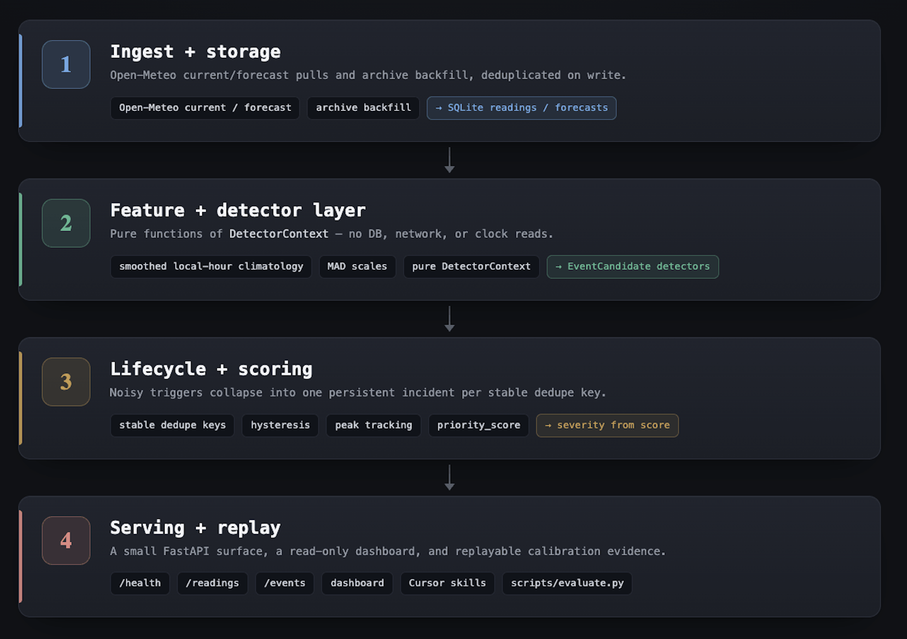

# WatchAgent

WatchAgent is a service that monitors Open-Meteo for Ottawa, Toronto, and Vancouver and surfaces notable weather as a ranked incident feed. Its premise is that **notability is a calibration problem, not a fixed rule**: detection thresholds are per-metric empirical tails rather than a single shared cutoff, scoring keeps statistical rarity and physical hazard as separate axes, and the detectors are validated by historical replay against external weather-alert windows — recall conditional on what the reanalysis can resolve is **89%**, and observed matches sit well above a permutation baseline.

Mechanically, the service polls Open-Meteo hourly, deduplicates readings, detects incidents with deterministic logic (not an LLM), stores them in SQLite, and exposes a small FastAPI API plus a read-only dashboard. The event-design layer is the substance: a smoothed local-hour climatology, pure detectors, DB-backed lifecycle collapse that turns noisy triggers into incidents, and replayable calibration evidence.

## Quickstart

No API keys are required for the service. Open-Meteo is the only live weather provider, and the committed `app/data/climatology.json` artifact is loaded from disk at startup. The app does not fetch archive data during boot.

```
git clone <repo-url>
cd watchagent
cp .env.example .env
docker compose up --build
```

In another shell:

```
curl http://localhost:8000/health
curl "http://localhost:8000/readings?limit=5"
curl "http://localhost:8000/events?limit=5"
```

`/readings` and `/events` may be empty on a fresh database until the poller stores its first Open-Meteo response, but the endpoints respond without credentials. If port 8000 is already in use, set `HOST_PORT` in `.env` before starting Compose.

The dashboard window control includes fixed 24-hour, 7-day, and 14-day views plus a custom 1–60 day view. Custom windows are reflected in the URL as `?window=custom&days=30`.

### Recreate a local dev DB

This repo does not use Alembic. Schema changes are additive in SQLAlchemy models, and a clean clone creates the right SQLite tables automatically. Existing local databases from an older schema should be recreated:

```
docker compose down
rm -f data/watchagent.db data/watchagent.db-*
docker compose up --build
```

### Backfill for local testing

Backfill uses Open-Meteo archive data and writes to the local database. It does not use ECCC or credentials.

```
docker compose exec api python -m app.backfill --days 90 --chunk-days 31
curl "http://localhost:8000/events?limit=10"
```

Set `ENABLE_POLLER=false` in `.env` while backfilling if you want to avoid mixing live and historical readings.

### Rebuild climatology

Runtime code loads the committed climatology artifact. To refresh it offline:

```
python3 scripts/build_climatology.py --start-date 2015-01-01 --end-date 2021-12-31
```

The committed artifact is intentionally fit on a historical training window. Evaluation replays use a later, disjoint test window, so detector-rate claims are never measured on the same years used to define the seasonal baselines.

## Architecture

<!-- ```
1. Ingest + storage
   Open-Meteo current/forecast pulls and archive backfill -> SQLite readings/forecasts
        |
        v
2. Feature + detector layer
   smoothed local-hour climatology, MAD scales, pure DetectorContext -> EventCandidate detectors
        |
        v
3. Lifecycle + scoring
   stable dedupe keys, hysteresis, peak tracking, priority_score, severity from score
        |
        v
4. Serving + replay
   /health, /readings, /events, dashboard, Cursor skills, scripts/evaluate.py
``` -->


Important boundaries:

- The live pipeline uses Open-Meteo only.
- Detectors are pure functions of `DetectorContext`; no DB, network, or clock reads.
- `/health`, `/readings`, and `/events` contracts are additive.
- Event lifecycle state is DB-backed in `incident_states`, so incidents survive poller restarts.

## API

### `GET /health`

```
{
  "status": "ok",
  "readings_stored": 3,
  "events_stored": 1
}
```

### `GET /readings`

Query parameters:

- `city`: optional, one of `Ottawa`, `Toronto`, `Vancouver`
- `start`, `end`: optional timezone-aware datetimes
- `limit`: optional, default `50`, max `500`

```
{
  "readings": [
    {
      "id": 1,
      "city": "Toronto",
      "observation_ts": "2026-05-27T18:00:00Z",
      "polled_at": "2026-05-27T18:05:00Z",
      "temperature_2m": 21.5,
      "apparent_temperature": 20.9,
      "precipitation": 0.0,
      "wind_speed_10m": 12.3,
      "weather_code": 1,
      "surface_pressure": 1004.2,
      "pressure_msl": 1011.8,
      "relative_humidity_2m": 71,
      "dew_point_2m": 16.2,
      "wind_gusts_10m": 34.0,
      "cloud_cover": 88,
      "snowfall": 0.0,
      "snow_depth": null
    }
  ]
}
```

Open-Meteo occasionally omits fields by city/hour/model. Enriched fields are nullable by design.

### `GET /events`

Query parameters:

- `city`: optional, one of `Ottawa`, `Toronto`, `Vancouver`
- `start`, `end`: optional timezone-aware datetimes
- `limit`: optional, default `50`, max `500`

The feed sorts by `priority_score` first, then recency. Existing fields remain present, and lifecycle/scoring fields are additive.

```
{
  "events": [
    {
      "id": 1,
      "city": "Toronto",
      "event_ts": "2024-08-15T20:00:00Z",
      "created_at": "2024-08-15T20:05:01Z",
      "event_type": "heavy_rain_burst",
      "severity": "severe",
      "metric": "precipitation",
      "signal_values": {
        "amount_mm": 18.0,
        "accumulation_mm": 24.0,
        "wet_hour_quantile_mm": 5.0,
        "absolute_hazard_floor_mm": 10.0,
        "threshold_mm": 10.0,
        "trigger": "hourly",
        "threshold_source": "training_wet_hour_upper_quantile_with_hazard_floor"
      },
      "reason": "Toronto has a heavy rain burst: 18.0 mm this hour and 24.0 mm over 6h.",
      "supporting_reading_ids": [101, 102, 103],
      "status": "ongoing",
      "onset_ts": "2024-08-15T20:00:00Z",
      "peak_ts": "2024-08-15T20:00:00Z",
      "resolved_ts": null,
      "priority_score": 74.2,
      "confidence": 0.95,
      "dedupe_key": "Toronto|heavy_rain_burst|precipitation",
      "evidence": {
        "lifecycle": {
          "peak_strength": 24.0,
          "clear_count": 0
        }
      }
    }
  ]
}
```

## Event Design

WatchAgent detects incidents, not one row per noisy trigger. A detector emits `EventCandidate` objects from a pure `DetectorContext`; the lifecycle manager then opens, updates, or resolves one persistent `Event` per stable `dedupe_key`.

Scoring is centralized in `app/detection/scoring.py`. Each detector provides normalized score inputs — rarity, magnitude, persistence, compound evidence, forecast surprise, spatial separation, and confidence. `priority_score` is a weighted 0–100 value, and stored `severity` is derived from it: `<30 info`, `30-59 warning`, `>=60 severe`. The severe floor is set to the replayed incident-score p90, so severe stays the rare top tier (**10.2%** of incidents at floor 60, versus 24% at 55); a top-tier alert should be rare and actionable rather than a quarter of the feed.

### Two orthogonal axes: rarity and magnitude

Rarity and magnitude are deliberately **different questions**, not two functions of the same z-score:

- **Rarity = statistical tail position.** It is the empirical **surprisal**, `-log(tail probability) = -log(1 - empirical_CDF)`, computed from per-metric training tail anchors stored in the climatology artifact. A 1-in-1000 event scores strictly above a 1-in-100 event instead of both saturating; surprisal is capped near a 1-in-10,000 tail (`-log(1e-4)`) so realistic extremes separate near the top rather than clipping mid-range.
- **Magnitude = absolute physical size.** It is the raw hazard in native units — mm of rain, °C of departure from the baseline median, km/h of gust — normalized against a fixed physical anchor (for example ECCC-scale rainfall and gust amounts).

Because the axes are orthogonal, a **rare-but-small** event (an odd reading far in the tail but physically minor) and a **common-but-large** event (a physically big number that is normal for that city and hour) land at different scores instead of reinforcing each other. Surprisal also de-saturates events that the old clipped/binary rarity over-credited.

### Detector catalog

| detector | phenomenon | statistic | threshold and calibration hypothesis |
| --- | --- | --- | --- |
| `temperature_shock` | Sudden temperature jumps unusual for that city and hour. | Smooth local-hour `z_hod` plus a 3-hour temperature derivative. | Temperature residual must exceed the training artifact's empirical 99.5th upper tail or 0.5th lower tail (`+2.75 / -2.79 z` in the current 2015–2021 artifact) **and** `abs(delta_3h) >= 5°C`. Preserves the diurnal-aware baseline from the old rapid-change rule while dropping the shared `z=3` assumption. |
| `pressure_plunge` | Pressure falls that often precede stormy conditions. | 3-hour sea-level pressure fall, confirmed by wind/gust rise. | At least a 6 hPa fall plus wind corroboration. Replay showed weaker falls were ordinary noise, so the threshold keeps only sharper, compound signals. |
| `warm_spell` | Persistent locally extreme warmth. | Temperature `z_hod` above the smoothed local-hour climatology, collapsed by lifecycle hysteresis. | Residual above the empirical 99.5th training tail (`+2.75 z`). Replaces spammy `sustained_extreme`; in the 2022–2025 test replay, 67,513 old raw firings became 176 warm/cold spell incidents. |
| `cold_spell` | Persistent locally extreme cold. | Temperature `z_hod` below the smoothed local-hour climatology, collapsed by lifecycle hysteresis. | Residual below the empirical 0.5th training tail (`-2.79 z`). Same rare-tail spell hypothesis as warm spells, with score magnitude lifting extreme cold outbreaks to severe. |
| `heavy_rain_burst` | Flash-flood-style rain bursts and short accumulations. | Current hour must be wet; wet-hour amount and 6-hour accumulation against wet-hour-only baselines. | Wet current hour, hourly amount at least `max(training wet-hour 99.5th percentile, 10 mm)`, **or** 6-hour accumulation at least `12.5 mm/6h` (a quarter of the ECCC 50 mm/24h rainfall warning). The artifact's wet-hour 99.5th percentile is only `5.0 mm`, so the absolute hazard floor prevents a compressed wet-hour distribution from turning moderate rain into flood-style incidents. The 6h bar was raised from a round 10 mm on rain-mix evidence: 10 mm/6h is steady ~1.7 mm/h rain, not a burst. Rarity uses surprisal against the hourly and 6h empirical wet tails; magnitude is absolute mm against ECCC anchors. |
| `wind_gust_burst` | Locally unusual gusts with operational damage potential. | `wind_gusts_10m` anomaly against local-hour climatology, plus an ECCC-scale absolute anchor. | Gust residual above the empirical 99.5th training tail (`+4.05 z`) **or** gust around 90 km/h. The absolute anchor stays an OR gate so dangerous gusts fire regardless of local z. |
| `heat_stress` | Dangerous heat load from temperature plus moisture. | Humidex from temperature and dew point. | Humidex `>= 38`, with Humidex 40 as a strong anchor. Full-season replay produced non-trivial but not constant summer incidents. |
| `cold_stress` | Dangerous wind chill from cold plus wind. | Wind Chill Index from temperature and wind speed. | Wind chill `<= -25` with valid cold/wind inputs. City-center archive data made `-30` effectively dead, so `-25` keeps real winter stress visible. |
| `forecast_bust` | A live forecast miss large enough to matter operationally. | `abs(observed - stored_forecast) / max(global rolling MAE, metric_floor)`. | Normalized error `>= 2.5` with at least 3 recent obs/forecast pairs. Archive replay has no historical forecast pairs, so this is exercised by unit/labeled tests and live DB operation (see the evaluation note). |
| `spatial_anomaly` | One city is anomalous relative to its own climate and its peers. | Own-city `z_hod`, then gap from the median peer `z_hod` across temperature, gust, and pressure. | Own metric must first exceed that metric's empirical training tail, then the peer z-gap must be `>= 5.0`. Wind-gust spatial checks are upper-tail only. Prevents "normal Vancouver mildness while Ottawa freezes" from counting as an event; geography alone is not a hazard. |

`wmo_transition` is no longer a primary event. WMO weather-code tier changes are treated as supporting evidence where useful, not a spammy feed item.

### Robust statistics

- **Median/MAD over mean/std.** Weather tails are heavy and seasonal; one storm should not drag the baseline the way a mean and standard deviation can.
- **MAD floor.** `max(1.4826 * MAD, metric_epsilon)` prevents zero-variance buckets from creating infinite z-scores.
- **Smoothed local-hour baseline.** Climatology is keyed by `(city, local_day_of_year, local_hour)`, and each bucket uses a transparent ±15-day training window at the same local hour. This removes month-boundary discontinuities without smearing the diurnal cycle. The tradeoff is mild seasonal smoothing around genuinely abrupt transitions.
- **Empirical tail gates.** Z-scores remain diagnostic, but z-gated detectors enter on per-metric training quantiles. The shared `z=3` rule is retired because each metric's residual distribution has its own asymmetry and tail width: the current training artifact puts temperature tails near `+2.75 / -2.79 z`, while gusts require `+4.05 z`.
- **Anomaly vs hazard floors.** Pure anomaly detectors (`temperature_shock`, spells, spatial) use distributional quantiles only. Hazard detectors keep absolute operational floors as well — `heavy_rain_burst` uses `max(wet-hour quantile, 10 mm)` hourly plus a `12.5 mm/6h` accumulation bar, and `wind_gust_burst` keeps the 90 km/h ECCC-scale anchor.
- **Surprisal rarity vs absolute magnitude.** The rarity input is empirical surprisal `-log(tail probability)` from per-metric training anchors, capped near a 1-in-10,000 tail; the magnitude input is absolute physical size in native units. The two axes are scored independently so statistical rarity and physical hazard do not collapse into one number.
- **Precip occurrence vs amount.** Dry hours are modeled separately from wet-hour amount percentiles, so heavy rain is never compared to a zero-dominated median.
- **Lifecycle hysteresis.** Incidents open after enter criteria and resolve only after clear criteria, which debounces borderline oscillation and preserves stable onset/peak times.

### Confidence

Candidates carry a normalized confidence score. Confidence is lowered when the feature layer falls back to a thinly-populated `(city, local_day_of_year, local_hour)` baseline bucket, when peer data is missing for spatial comparison, when forecast-bust lacks enough rolling MAE pairs, or when key weather variables are unavailable. Low confidence suppresses the score rather than changing the API shape.

## Evaluation Evidence

The replayable evidence lives in [EVALUATION.md](./EVALUATION.md):

```
python3 scripts/evaluate.py --source archive --start-date 2022-01-01 --end-date 2025-12-31
```

The replay uses the committed 2015–2021 climatology artifact as training data and measures rates on the disjoint 2022–2025 archive test window. The artifact uses a day-of-year smoothing window for median and MAD, then recomputes empirical threshold quantiles and per-metric tail anchors from smooth training residuals only: upper 99.5th tails, lower 0.5th tails, wet-hour-only 99.5th percentile rain amount, plus the survival-curve anchors that drive the surprisal rarity axis. The quantile level is a fixed rare-tail hypothesis, not tuned to hit an event-rate target. Scoring then replaces clipped/binary rarity with surprisal, decorrelates magnitude onto an absolute-physical axis, sets the severe floor to the incident-score p90 (`>=60` → 10.2% severe), and uses a `12.5 mm/6h` rain accumulation bar.

- Legacy raw detector firings: **127,164**
- Native lifecycle incidents: **788**
- Overall rate: **0.180 incidents/city-day**
- Raw-firing to incident collapse ratio: **4.39×** on native candidates
- `sustained_extreme` replacement: **67,513 raw firings → 176 spell incidents**

Per-type after-state:

| detector_type | incidents | per_city_day |
| --- | --- | --- |
| `temperature_shock` | 20 | 0.005 |
| `pressure_plunge` | 52 | 0.012 |
| `warm_spell` | 99 | 0.023 |
| `cold_spell` | 77 | 0.018 |
| `heavy_rain_burst` | 207 | 0.047 |
| `wind_gust_burst` | 131 | 0.030 |
| `heat_stress` | 53 | 0.012 |
| `cold_stress` | 69 | 0.016 |
| `forecast_bust` | 0 \* | 0.000 |
| `spatial_anomaly` | 80 | 0.018 |

\* Not exercisable in archive replay — Open-Meteo's archive returns observations, not the forecasts issued at the time. Covered by unit and labeled tests and by live operation; see the forecast note below.

Boundary diagnostics in `EVALUATION.md` compare a fixed noon temperature value across Dec 31 → Jan 1 and May 31 → Jun 1. Month/local-hour buckets showed jumps of about `0.56–1.26 z`; the smooth day-of-year/local-hour baseline reduces those jumps to `0.00–0.03 z`.

**Forecast note.** Forecast-bust is zero in archive replay because Open-Meteo archive provides observations, not the forecasts issued at the time. The detector fires in `tests/test_native_detectors.py::test_forecast_bust_fires_on_error_over_rolling_mae` and in the labeled `forecast_bust_simple_mae` scenario; live operation compares readings against stored forecast rows from the current/forecast pull.

### Quantitative validation

Offline, no credentials; the live pipeline stays Open-Meteo. ECCC exposes no stable public API for historical alert archives, so recall is measured against a curated, sourced set of 15 high-impact weather windows (ECCC annual top-ten weather stories) for the three cities over 2022–2025, matched with ±1 day padding. Full tables in [EVALUATION.md](./EVALUATION.md).

- **Recall conditional on resolvable events: 8/9 = 89%.** Of 7 expected-type misses, 6 are resolution false negatives (hourly ERA5 flattened the convective/localized peak below a gate) and only 1 is a genuine detector gap. The label set is biased toward exactly the convective extremes hourly reanalysis cannot resolve, so this conditional figure reflects detector quality better than the raw rate.
- **Top-30 precision proxy: 67% useful, 33% borderline, 0% noise**, labeled against physical-significance bars independent of the score. Borderline cases are all 13–20 mm/6h multi-hour rain — real but not burst-intensity; nothing at the top of the feed is noise.
- **Chance-recall check.** Permuting labels to random same-length windows yields 12% mean recall, so the observed matches sit well above spurious ±1-day matching.
- **Raw expected-type recall.** 8/15 = 53% any-tier (Wilson 95% CI 30–75%), 3/15 = 20% severe-tier — the right detector had to fire. Any-incident-any-type (loose upper bound): 10/15 = 67%; the gap is two cold windows where a `pressure_plunge` fired but the cold detectors did not.
- **Headline false negatives, explained.** The Toronto 2024-07-16 and Ottawa 2023-06-26 floods are confirmed missed — ECCC alerted, the backtest did not detect — because grid-smoothing flattens the convective peak below the 12.5 mm/6h bar. A backtest-data limit, not a detector regression; finer live data would likely clear it.
- N=15 is a small, deliberately hard, biased sample: read these as a directional lower bound, not a precise estimate.

Known-event spot checks from the same replay:

| documented event | date | incident |
| --- | --- | --- |
| Toronto heavy rainfall/flooding | 2024-07-16 | **not detected** (false negative): ERA5 peak 4.3 mm/h, 11.0 mm/6h, below the 10 mm/h floor and 12.5 mm/6h bar |
| Vancouver January deep freeze | 2024-01-12 | `cold_spell / temperature_2m`, priority 70.0, severe |
| Ottawa severe thunderstorm/outages | 2023-06-26 | **not detected** (false negative): ERA5 peak 5.0 mm/h, 10.6 mm/6h, below the 10 mm/h floor and 12.5 mm/6h bar |

The two convective rain spot checks are false negatives in ERA5 replay: no `heavy_rain_burst` candidate fires, because hourly ERA5 reanalysis grid-smooths the convective peak (real events exceeded 100 mm in pockets) down to ~5 mm/h and ~11 mm/6h, below the principled 10 mm/h floor and 12.5 mm/6h bar. This is a data-resolution limit, not a detector or scoring regression; finer-resolution live observations would very likely clear the bar. Both events remain covered by unit and labeled tests. The Vancouver cold spell — a genuine multi-day tail event that ERA5 does resolve — still scores severe (70).

## Known Limitations

These are honest constraints of the current build, distinct from the methods deliberately left out below.

- **Reanalysis resolution.** The backtest runs on hourly ERA5, which spatially smooths localized convective extremes; the Toronto/Ottawa floods are confirmed false negatives for this reason. The detector logic is unaffected — live operation uses finer-resolution Open-Meteo model data — but historical recall on convective events is understated.
- **Validation sample size.** External weak labels are N=15 curated windows; the recall figures are directional, with wide confidence intervals, not precise estimates.
- **Baseline non-stationarity.** The climatology is fit on a fixed 2015–2021 window. As the climate warms, a fixed historical baseline drifts — visible as a mild warm-spell/cold-spell asymmetry on the later test years — and would benefit from periodic refitting.
- **Spatial with three cities.** `spatial_anomaly` compares a city against the median of two peers; it is a defensible heuristic, not a robust spatial statistic, and would strengthen with more stations.
- **Single-writer storage.** SQLite is right for three cities and hourly cadence, but it is a single-writer store. The scale path is SQLite → Postgres, poller → scheduler/queue, and committed artifact → artifact store; detectors are already pure functions, so they parallelize cleanly.

## Deliberately Out of Scope

- **EVT/GPD.** Attractive for tail modeling, but too much calibration surface for this take-home.
- **BOCPD, ADWIN, PELT.** Change-point tools were cut to keep behavior explainable and testable with hourly weather data.
- **Isolation Forest.** Would obscure why an event fired and require broader validation data.
- **LSTM or other sequence models.** Not justified for three cities, limited labels, and a deterministic operational feed.
- **Live ECCC alerts.** Useful as offline weak labels, but the live pipeline remains Open-Meteo only.
- **Lead-conditioned forecast bust.** Forecast storage keeps one forecast per target time; lead-binned forecast-error calibration is documented future work.

## Cursor Setup

The `.cursor/` directory is a development-time artifact for reviewing and replaying the actual WatchAgent design.

**Rules**

- `.cursor/rules/detection-purity.mdc`: detectors are pure `DetectorContext -> list[EventCandidate]` functions.
- `.cursor/rules/event-record-contract.mdc`: candidates and stored events must remain explainable, scored, and additive.
- `.cursor/rules/poller-failure-policy.mdc`: the poller logs and continues through upstream failures.
- `.cursor/rules/time-handling.mdc`: all datetimes are timezone-aware UTC at storage/API boundaries.
- `.cursor/rules/test-mocking.mdc`: API-touching tests mock network calls.

**Agent**

- `.cursor/agents/event-logic-reviewer.md`: reviews detector and lifecycle changes against cold-start behavior, missing variables, confidence, dedupe keys, scoring inputs, and replay evidence.

**Skills**

- `.cursor/skills/data-analysis`: `python3 .cursor/skills/data-analysis/analyze.py "question"` answers read-only questions against the local DB; `digest.py` produces grounded event briefs.
- `.cursor/skills/replay-detection`: `python3 .cursor/skills/replay-detection/replay.py --limit 100` replays current candidates and lifecycle state over stored readings without writing events.
- `.cursor/skills/explain-event`: `python3 .cursor/skills/explain-event/explain.py --event-id 1` prints the stored lifecycle, score, evidence, and related reading context for one event.

The optional LLM-backed data-analysis skill requires `ANTHROPIC_API_KEY`. The WatchAgent service, tests, and Docker startup do not.

## Development

```
python3 -m pip install -e ".[dev]"
.venv/bin/pytest -q
.venv/bin/ruff check app tests scripts
npm --prefix frontend install
npm --prefix frontend run typecheck
npm --prefix frontend run lint
docker compose build
```

CI runs lint, tests, frontend checks, and a Docker build, and boots the containerized service with `docker compose up --build --wait` to assert `GET /health` returns 200 with the expected JSON shape (poller disabled, fresh empty DB). Tests that touch Open-Meteo use mocks; no credentials are committed or required.

## Tech Choices

- **FastAPI** for typed response models, async lifespan hooks, and generated `/docs`.
- **httpx + asyncio** for concurrent Open-Meteo polling with retry/backoff.
- **SQLite + SQLAlchemy** because three cities and hourly readings do not need distributed infrastructure.
- **React dashboard** served from the same FastAPI origin, avoiding CORS and frontend secrets.
- **structlog** for JSON logs with poll-cycle trace IDs.
- **pytest + respx** for deterministic storage, API, and Open-Meteo tests.

## Future Work

- Add Alembic once schema evolution needs non-additive migrations.
- Add lead-binned forecast-bust calibration once historical forecast pairs are available.
- Add an aggregate `/event-counts` endpoint for dashboard filtering.
